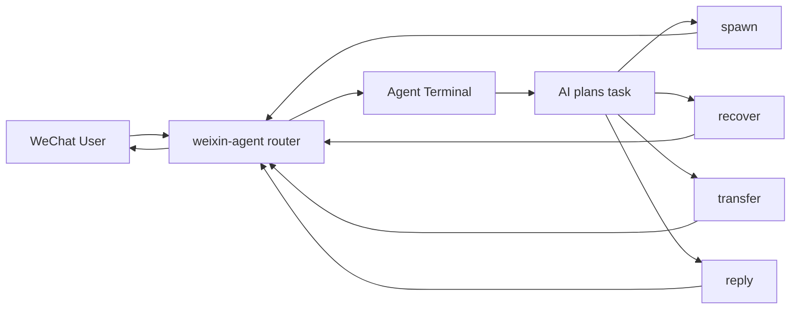
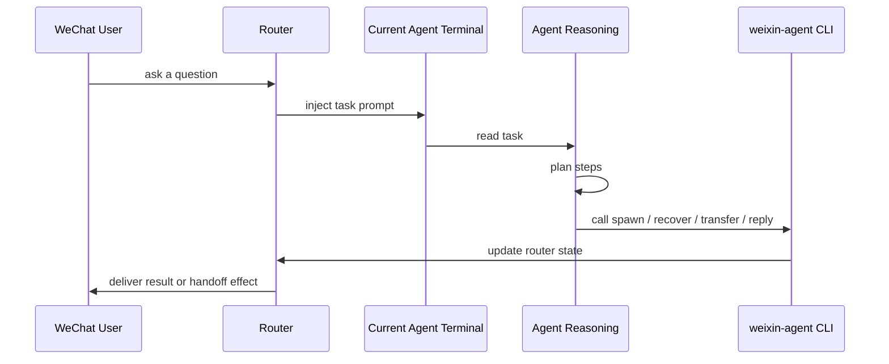

# weixin-agent

[English](./README.md) | [简体中文](./README.zh-CN.md)

An AI-facing control plane for routing WeChat work into live local terminal agents.

`weixin-agent` is not primarily a human-operated dashboard. Its core job is to expose a stable tool surface that an AI agent can call while handling a WeChat task inside a terminal session.

## The Core Idea

The normal loop is:

1. A user asks something in WeChat.
2. An AI agent receives the routed task in its terminal.
3. The AI plans the work.
4. The AI calls `weixin-agent` commands such as `spawn`, `recover`, `transfer`, and `reply`.
5. The result goes back to WeChat.

The human usually bootstraps the environment once. After that, the AI does the operational work.



## Who Does What

Human operator:

- installs the CLI
- logs into the WeChat channel
- starts the global router
- attaches or spawns the initial agent terminals

AI agent:

- reads the user request
- decides whether to solve, delegate, reopen, or create another agent
- calls `weixin-agent` commands
- sends the final answer back with `reply --ticket`

WeChat user:

- asks in natural language
- can optionally use `@agent-name` for strict routing

## End-to-End Flow



## The Most Important User Scenarios

### 1. User asks another named agent to take over

User asks:

```text
@豆包1号 把这个任务转给豆包2号处理
```

AI plan:

1. Keep the current ticket identity correct.
2. Decide whether `豆包2号` is already online.
3. Transfer the ticket instead of replying from the wrong agent.

Tool call:

```bash
weixin-agent transfer --ticket <ticket-id> --to "豆包2号"
```

### 2. User asks to create a new agent for a subtask

User asks:

```text
再开一个新的 Codex 智能体，名字叫前端修复1号，专门处理这个页面问题
```

AI plan:

1. Check that the user already provided a full explicit name.
2. Create a new terminal agent.
3. Optionally hand the ticket over to that new agent.

Tool calls:

```bash
weixin-agent spawn codex --name 前端修复1号
weixin-agent transfer --ticket <ticket-id> --to "前端修复1号"
```

### 3. User wants an offline agent back

User asks:

```text
把豆包2号重新叫回来继续这个会话
```

AI plan:

1. Reopen the known offline agent under the same name.
2. Continue routing work to that agent.

Tool call:

```bash
weixin-agent recover --name 豆包2号
```

### 4. User wants the final result sent back to WeChat

User asks:

```text
处理完后直接回我，顺便把截图发回来
```

AI plan:

1. Finish the task in the current terminal.
2. Send the final text reply.
3. If needed, attach media.

Tool calls:

```bash
weixin-agent reply --ticket <ticket-id> --stdin
weixin-agent reply --ticket <ticket-id> --media /abs/path/to/screenshot.png --message "See screenshot"
```

## AI Tool Surface

Use `spawn` when:

- the user explicitly wants a new agent
- a new terminal should be created
- the user has already chosen a full unique display name

Use `recover` when:

- the user wants a known offline agent back
- the remembered agent for the conversation is offline

Use `transfer` when:

- another connected agent should take the ticket
- the current terminal should not reply under the wrong identity

Use `reply` when:

- the task is complete
- the current terminal is the one that should answer the user

## Why This Matters

Without this AI-facing control plane, a terminal agent can reason about delegation but cannot act on it safely.

With `weixin-agent`, the agent can:

- create another agent deliberately
- reopen an offline agent deliberately
- hand work off explicitly
- send the final answer back explicitly

That is the real product boundary.

## Human Setup

Published package:

- npm: `https://www.npmjs.com/package/weixin-agent`
- GitHub: `https://github.com/duo121/weixin-agent`

Requirements:

- Node.js `>=22`
- macOS
- iTerm2 or Terminal
- macOS Automation / Accessibility permissions for terminal control

Install:

```bash
npm install -g weixin-agent
```

Bootstrap:

```bash
weixin-agent doctor
weixin-agent account login
weixin-agent start
```

Attach an existing terminal:

```bash
weixin-agent connect --session <id|handle> --name 豆包1号
```

Or proactively open a new one:

```bash
weixin-agent spawn codex --name 豆包2号
```

## Routing Rules

- A leading `@agent-name` uses strict routing.
- Without `@agent-name`, the router first tries the recent agent remembered for that conversation.
- If there is no recent agent, the router falls back to the latest connected live agent.
- If zero live agents exist, the router can auto-spawn one default terminal agent first.
- If a remembered or explicitly named agent is offline, the system can try to reopen that agent before rerouting.

## Current Status

Implemented:

- machine-readable `spec`
- `doctor`, `status`, account/config inspection
- QR login with local credential persistence
- global router runtime
- multi-agent attach / spawn / recover
- explicit naming and rename flows
- conversation-level recent-agent memory
- `transfer --ticket` handoff
- `reply --ticket` text and media replies
- iTerm2 / Terminal session discovery on macOS
- terminal-native plus TTY-based prompt injection

Current limitation:

- The target terminal still needs to call `reply --ticket` explicitly to send the final answer back to WeChat.
- The older `bridge ...` observation path still exists as a prototype and is not the primary workflow.

## State Layout

- State root: `~/.weixin-agent/`
- User config: `~/.weixin-agent/config.json`
- Accounts: `~/.weixin-agent/accounts/`
- History: `~/.weixin-agent/history/<account>.jsonl`
- Agents: `~/.weixin-agent/agents/`
- Tickets: `~/.weixin-agent/tickets/`

## Command Overview

Bootstrap:

```bash
weixin-agent doctor
weixin-agent account login
weixin-agent start
```

Agent lifecycle:

```bash
weixin-agent connect --session <id|handle> --name <displayName>
weixin-agent spawn codex --name <displayName>
weixin-agent recover --name <displayName>
weixin-agent disconnect --session <id|handle>
weixin-agent agents list
```

Ticket operations:

```bash
weixin-agent transfer --ticket <id> --to "豆包2号"
weixin-agent reply --ticket <id> --stdin
weixin-agent reply --ticket <id> --message "..."
```

Identity and config:

```bash
weixin-agent rename template "豆包{n}号"
weixin-agent rename agent --current-name 豆包1号 --to 豆包2号
weixin-agent self status
weixin-agent self rename --name <displayName>
weixin-agent self disconnect
weixin-agent config get
weixin-agent config set <key> <value>
```

## Architecture

- [Architecture](./docs/architecture.md)
