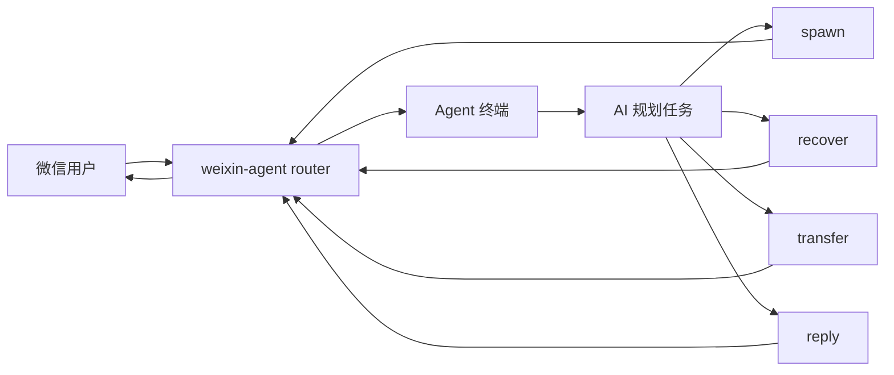
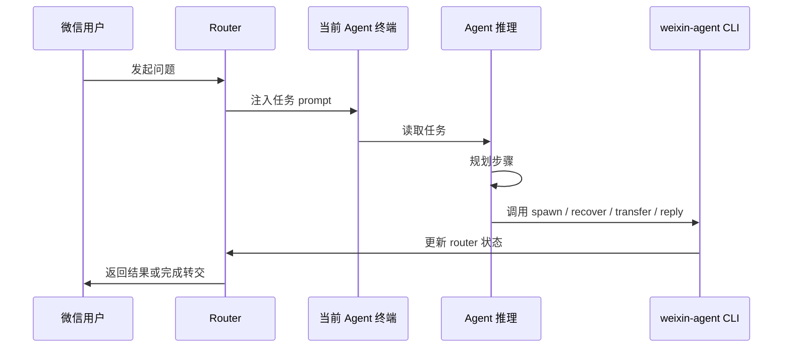

# weixin-agent

[English](./README.md) | [简体中文](./README.zh-CN.md)

一个面向 AI 调用的控制平面，把微信任务路由到正在运行的本地终端智能体。

`weixin-agent` 不是一个主要给人类手工操作的面板。它最核心的价值，是给终端里的 AI 提供一套稳定的工具接口，让 AI 在处理微信任务时可以主动调用 `spawn`、`recover`、`transfer`、`reply` 这些能力。

## 核心概念

正常工作闭环应该是：

1. 用户先在微信里提问。
2. 一个 AI agent 在终端里收到这个任务。
3. AI 先规划任务。
4. AI 再调用 `weixin-agent` 工具命令。
5. 最终结果回到微信。

也就是说，通常是人类做一次初始化，之后由 AI 负责持续操作。



## 谁负责什么

人类操作员：

- 安装 CLI
- 登录微信通道
- 启动全局 router
- attach 或先拉起第一批 agent 终端

AI agent：

- 读取用户请求
- 判断是自己处理、转交、重拉离线 agent，还是新建 agent
- 调用 `weixin-agent` 命令
- 用 `reply --ticket` 把结果回微信

微信用户：

- 用自然语言提问
- 必要时可以用 `@agent-name` 指定某个智能体

## 端到端流程



## 最关键的用户场景

### 1. 用户要求另一个命名 agent 接手

用户提问：

```text
@豆包1号 把这个任务转给豆包2号处理
```

AI 规划：

1. 保持当前 ticket 的身份正确。
2. 判断 `豆包2号` 是否已经在线。
3. 不从错误身份直接回复，而是显式转交 ticket。

工具调用：

```bash
weixin-agent transfer --ticket <ticket-id> --to "豆包2号"
```

### 2. 用户要求创建一个新的 agent 来处理子任务

用户提问：

```text
再开一个新的 Codex 智能体，名字叫前端修复1号，专门处理这个页面问题
```

AI 规划：

1. 确认用户已经给了完整且明确的名字。
2. 创建一个新的终端 agent。
3. 如有必要，把当前 ticket 转交过去。

工具调用：

```bash
weixin-agent spawn codex --name 前端修复1号
weixin-agent transfer --ticket <ticket-id> --to "前端修复1号"
```

### 3. 用户要求把离线 agent 叫回来

用户提问：

```text
把豆包2号重新叫回来继续这个会话
```

AI 规划：

1. 用同一个名字重新打开已知离线 agent。
2. 继续把任务路由给它。

工具调用：

```bash
weixin-agent recover --name 豆包2号
```

### 4. 用户要求把最终结果回到微信

用户提问：

```text
处理完后直接回我，顺便把截图发回来
```

AI 规划：

1. 在当前终端里完成任务。
2. 回最终文本。
3. 如果需要，再附带媒体文件。

工具调用：

```bash
weixin-agent reply --ticket <ticket-id> --stdin
weixin-agent reply --ticket <ticket-id> --media /abs/path/to/screenshot.png --message "见截图"
```

## AI 工具面应该怎么理解

什么时候用 `spawn`：

- 用户明确要求新开一个 agent
- 需要创建一个新的终端会话
- 用户已经给了完整且唯一的 display name

什么时候用 `recover`：

- 用户要把一个已知离线 agent 叫回来
- 当前会话记住的 agent 不在线了

什么时候用 `transfer`：

- 另一个已连接 agent 更适合处理当前 ticket
- 当前终端不应该用错误身份直接回复

什么时候用 `reply`：

- 任务已经完成
- 当前终端就是应该回用户的那个 agent

## 为什么这是产品核心

如果没有这套 AI 可调用的控制平面，终端里的 AI 最多只能“口头上”知道要委派、重拉、回复，但不能安全地执行这些动作。

有了 `weixin-agent` 之后，AI 才能：

- 有意识地新建另一个 agent
- 有意识地重拉离线 agent
- 显式地交接 ticket
- 显式地把最终答案发回微信

这才是这个项目真正的产品边界。

## 人类只需要做一次的初始化

已发布地址：

- npm: `https://www.npmjs.com/package/weixin-agent`
- GitHub: `https://github.com/duo121/weixin-agent`

环境要求：

- Node.js `>=22`
- macOS
- iTerm2 或 Terminal
- 用于终端控制的 macOS Automation / Accessibility 权限

安装：

```bash
npm install -g weixin-agent
```

初始化：

```bash
weixin-agent doctor
weixin-agent account login
weixin-agent start
```

attach 一个已经存在的终端：

```bash
weixin-agent connect --session <id|handle> --name 豆包1号
```

或者主动拉起一个新的终端：

```bash
weixin-agent spawn codex --name 豆包2号
```

## 路由规则

- 以 `@agent-name` 开头的消息走严格路由。
- 不带 `@agent-name` 时，router 会先尝试这个微信会话记住的最近 agent。
- 如果没有最近 agent，会回退到最近连接的在线 agent。
- 如果当前 0 个在线 agent，router 可以先自动拉起一个默认终端 agent。
- 如果记住的 agent 或显式指定的 agent 当前离线，系统可以先尝试把它重新打开。

## 当前状态

已实现：

- 机器可读的 `spec`
- `doctor`、`status`、账号和配置检查
- 二维码登录与本地凭据持久化
- 全局 router 运行时
- 多 agent attach / spawn / recover
- 显式命名与改名流程
- 按微信会话记住最近 agent
- `transfer --ticket` 显式交接
- `reply --ticket` 文本与媒体回复
- macOS 上 iTerm2 / Terminal 会话发现
- 基于终端原生能力和 TTY 的 prompt 注入

当前限制：

- 目标终端仍然需要显式执行 `reply --ticket`，才能把最终结果发回微信。
- 旧的 `bridge ...` 观测路径仍然只是原型，不是主工作流。

## 本地状态布局

- 状态根目录：`~/.weixin-agent/`
- 用户配置：`~/.weixin-agent/config.json`
- 账号：`~/.weixin-agent/accounts/`
- 历史：`~/.weixin-agent/history/<account>.jsonl`
- Agents：`~/.weixin-agent/agents/`
- Tickets：`~/.weixin-agent/tickets/`

## 命令概览

初始化：

```bash
weixin-agent doctor
weixin-agent account login
weixin-agent start
```

Agent 生命周期：

```bash
weixin-agent connect --session <id|handle> --name <displayName>
weixin-agent spawn codex --name <displayName>
weixin-agent recover --name <displayName>
weixin-agent disconnect --session <id|handle>
weixin-agent agents list
```

Ticket 操作：

```bash
weixin-agent transfer --ticket <id> --to "豆包2号"
weixin-agent reply --ticket <id> --stdin
weixin-agent reply --ticket <id> --message "..."
```

身份和配置：

```bash
weixin-agent rename template "豆包{n}号"
weixin-agent rename agent --current-name 豆包1号 --to 豆包2号
weixin-agent self status
weixin-agent self rename --name <displayName>
weixin-agent self disconnect
weixin-agent config get
weixin-agent config set <key> <value>
```

## 架构

- [Architecture](./docs/architecture.md)
